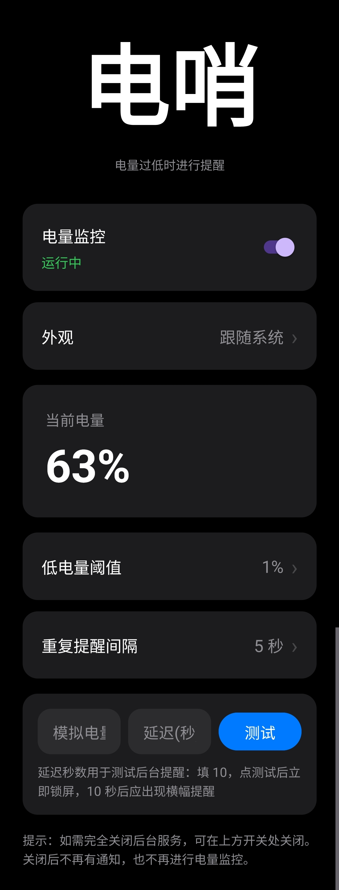

# 电哨

*主界面截图*

## 功能特性

- **低电量提醒**：电量低于设定阈值时，自动弹出横幅通知并响铃
- **自定义阈值**：可以自由设置触发提醒的电量百分比（默认 1%）
- **重复提醒**：未充电时会按设定的时间间隔反复提醒，直到充电
- **充电自动取消**：插上充电器后提醒立即停止
- **后台稳定运行**：结合前台服务和无障碍服务，最大限度保证后台存活
- **可调铃声**：在系统通知设置中自由更换提醒铃声
- **简洁界面**：仿 iOS 风格，清爽易用

## 使用方法

1. 打开 App，确保顶部「电量监控」开关处于开启状态
2. 点击「低电量阈值」设置触发提醒的电量（如 1%、5%、10%）
3. 点击「重复提醒间隔」设置未充电时的提醒间隔（如 20 秒、60 秒）
4. 授予通知权限
5. 在系统设置中为本应用开启无障碍服务
6. 在电池设置中将本应用设为「不受限制」，避免被系统清理

## 关于权限

- **通知权限**：显示低电量横幅提醒
- **前台服务**：保持后台电量监控运行
- **无障碍服务**：提高后台存活率，避免被系统杀死

## 技术栈

- Java
- Android SDK
- AndroidX

## 开发环境

- Android Studio
- 最低支持 Android 8.0 (API 26)
- 目标 Android 14 (API 34)

## 项目结构

- `MainActivity.java` — 主界面
- `BatteryService.java` — 前台服务，负责电量监控和提醒
- `MyAccessibilityService.java` — 无障碍服务，提高后台存活率

## 许可

本项目仅供个人学习使用。